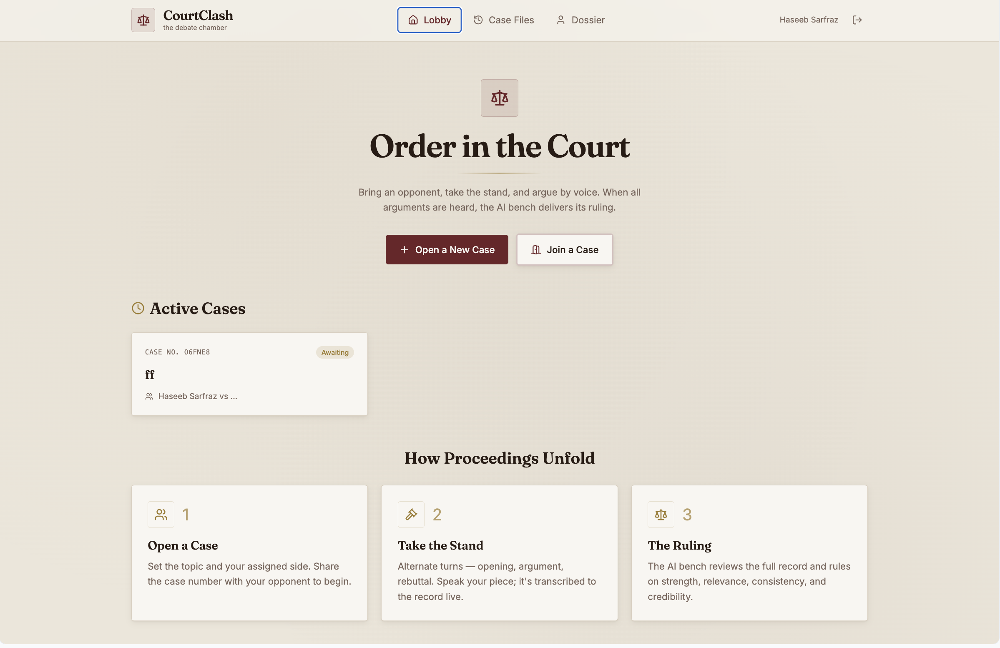

## Proposal
We are proposing a subscription based real time debate web application where two users can join a private debate room and argue opposite sides of a topic. Users will sign in using Google OAuth 2.0 and subscribe through Stripe sandbox before creating or joining rooms.

Each debate will have a topic, two participants, assigned sides, and a fixed turn based structure. This keeps the debate fair because both users will take turns giving arguments and rebuttals. As the debate happens, the system will store the transcript and room state in the database.

The main feature of the project is AI judging. At the end of the debate, the AI will review the full discussion and decide if Side A wins, Side B wins, it is a tie, or there is no credible winner. The verdict will be based on how strong, relevant, consistent, and credible the arguments are. The AI will also give a written explanation for its decision.

The app will also store user history over time. Users will be able to view past debates, past opponents, outcomes, and stats like total debates, wins, losses, ties, and win ratio. This makes the app more than a simple AI prompt tool because it has live users, real data, persistent state, and competitive tracking.

## Team
Siddharth Iyer - iyersid4
Haseeb Sarfraz - sarfra32
Hussein Khalil - khalilh7

We acknowledge the AI usage policy in CSCC09 and will adhere to it for this project.

## AI Assistant Summary: 

CourtClash uses AI as a debate referee. It follows the debate as it happens so the final decision reflects how each side argued and responded. At the end, it checks important facts, chooses a winner, and explains the ruling with supporting sources.

## Capabilities:

Assignees will be in brackets on the same line.

Authentication: Google for our OAuth 2.0 provider. (Haseeb)

Look and Feel: 1-page Base44 prototype mockup. (Hussein)

Real-time Enablement: We're using socket.io and socket.io-client. Connections share Express sessions and Passport authentication. (Siddharth)

AI Integration with MCP / Tools: (Haseeb)

**Which AI provider are we using?** We use OpenAI through the OpenAI API with two different models. GPT-4.1 mini performs the turn by turn debate monitoring. It extracts claims, supporting points, rebuttals, repetitions, and  contradictions from each submitted argument. GPT-5.6 Luna acts as the final debate judge. It receives the complete transcript and structured debate analysis, then uses web search to fact check important claims and generate a researched decision. Voice transcription is handled separately in the browser using the Web Speech API and does not use OpenAI.

**How are we integrating the AI?** We integrate OpenAI through our Express backend rather than calling it directly from the frontend. When an argument is submitted through sockets, the backend stores the transcript, sends the newest argument and debate history to the monitor model, and saves the resulting structured analysis in PostgreSQL. At the end of the debate, the backend sends the original transcript, aggregate analysis, and judging criteria to the final judge. The returned verdict is saved and emitted to both players through sockets. Keeping AI calls in the backend protects the API key and allows the server to control prompts.

Stripe Integration: Stripe test mode (Hussein)

Deployment: [project-courtclash.amazingcloud.space](https://project-courtclash.amazingcloud.space/) (Siddharth)

Architecture: (All)
